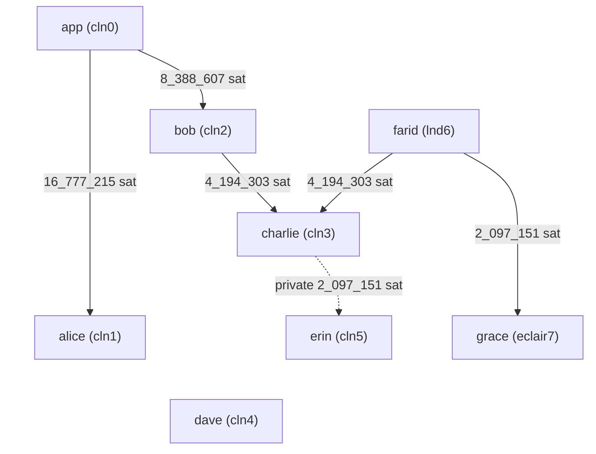

lightning-regtest-setup-devel
===

## Development

### Requirements
- docker compose (v2.32.1)
- jq (>=1.7.1)
- just (>=1.38.0)

### Clone
```
git clone https://github.com/theborakompanioni/lightning-regtest-setup-devel
```

### Typical workflow
```bash
just up
just init
just probe-payment
[...]
just clean
```

#### Bitcoin

##### Mining
Mine a single block:
```shell
just bitcoin mine
```

Mine 100 blocks:
```shell
just bitcoin mine 100
```

Mine 1 block to a specific address:
```shell
just bitcoin mine 1 bcrt1qrnz0thqslhxu86th069r9j6y7ldkgs2tzgf5wx
```


## Lightning Network Regtest Setup
### Nodes
#### CLN 0 (app)
The lightning node controlled by the application.

#### CLN 1 (Alice)
A user lightning node with a direct channel to the app node.

#### CLN 2 (Bob)
A user lightning node with a direct channel to the app node.

#### CLN 3 (Charlie)
A user lightning node with a direct channel to Bob and a private channel to Erin.

#### CLN 4 (Dave)
A user lightning node _without_ channels.
This is node solely exists to test the specific behaviour when no route can be found.

#### CLN 5 (Erin)
A node with a single incoming private channel from Charlie.

#### LND 6 (Farid)
A user lightning node with a direct channel to Charlie.


### Channels



## Resources
- Node Personas: https://en.wikipedia.org/wiki/Alice_and_Bob#Cast_of_characters
- Mermaid Flowchart: https://mermaid.js.org/syntax/flowchart.html
